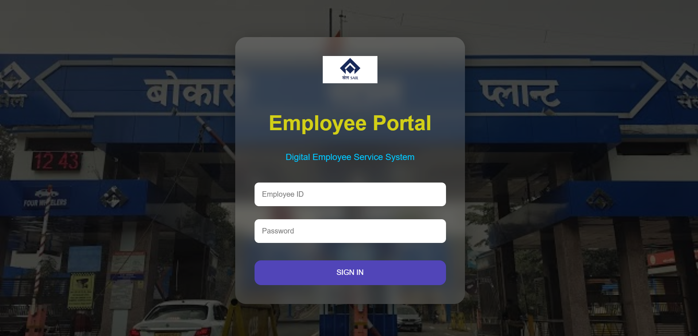
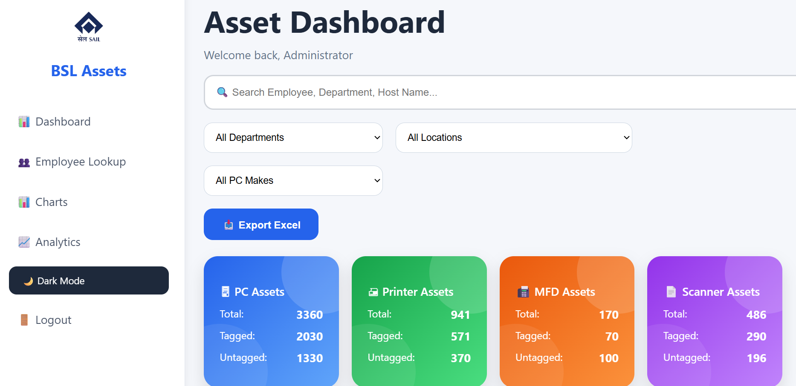

# BSL Asset Dashboard

A web-based Asset Management Dashboard developed using Flask and Python for tracking organizational assets across departments.

## Features

* Department-wise Asset Tracking
* Employee Asset Lookup
* Tagged vs Untagged Asset Monitoring
* Completion Rate Tracking
* Interactive Charts and Visualizations
* Excel Export Functionality
* Role-Based Access Control

## Tech Stack

* Python
* Flask
* Pandas
* HTML
* CSS
* JavaScript
* Chart.js
* Railway

## Screenshots

### Login Page

### Dashboard

### Employee Lookup

### Analytics

## Deployment

Live Demo: https://web-production-24957.up.railway.app/

## Author

Jiya Gupta
